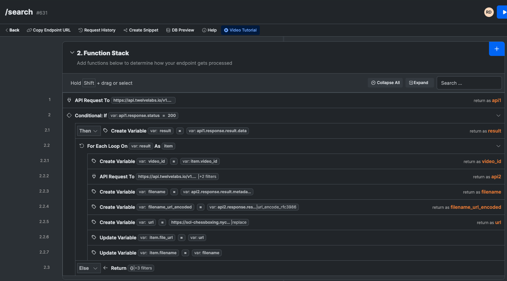

# Chessboxing AI Clips

## A note from the authors

This project was developed as part of the Twelve Labs Hackathon. The interesting aspect of participating in this hackathon was the models that twelve labs offer. Another interesting aspect of the hackathon was to use their models for sports analysis. For this reason we chose an obscure but super fun sport of Chessboxing. Our goal while building this project was to provide youtube shorts style clips that were symantically searchable within a larger video and shareable.

Initially, we experimented with both Pegasus and Marengo for the purpose of video understanding. As we dove deeper, we realized that the Marengo offered better results with its searching capabilities compared to Pegasus for our use case.

For simplicity of deployment, we used Xano (a no-code tool) to manage the API keys and calls to Twelve Labs as you can see in the screenshot below.

We also went a step further and added the capability to add AI generated music (that we generated through [suno.com](https://suno.ai)) overlayed with the clip that user chooses from their search results. This step involved some video processing using [ffmpeg](https://ffmpeg.org/) which further elevated the output.

[Sample Video Output](https://scl-chessboxing.nyc3.cdn.digitaloceanspaces.com/shorts/final_video_0d965b25-84d0-4962-82d6-545200971e21.mp4)

- By Akshay and Ray

## More Information about the project

This project is a web application built with React and TypeScript, using Vite for a fast and lean development environment. It's a unique application that allows users to discover and explore clips from Chessboxing - a hybrid sport that combines the physical demands of boxing with the mental challenge of chess

## Features

- **Search for Clips**: Users can search for specific clips based on their interests. For example, they can search for "knockouts", "checkmates", or even "terrible moves". The search functionality is powered by a backend API.

- **Clip Preview**: Users can preview a clip before deciding to add it to their list of highlights. The preview feature uses the Plyr library for a customizable video player.

- **Highlight Compilation**: Users can select multiple clips to create a highlight reel. They can choose to add background music to their compilation or keep it without music.

- **Shareable Highlights**: Once a highlight reel is created, users receive a unique URL that they can share on social media. The URL leads to a page where the highlight reel can be downloaded.

## Setup

The project uses Vite with React and TypeScript. To get started, clone the repository and install the dependencies using `npm install`. Then, start the development server using `npm run dev`.

## Code Structure

The main component of the application is `Home.tsx` (referenced from `app/src/Home.tsx`), which contains the logic for searching clips, previewing clips, and creating highlight reels. It also manages the state of the application, such as the list of search results and the currently selected clips.

## Assets

The project includes several assets, such as audio files for background music and a logo image. The logo image is used in various places in the application, such as the loading spinner and the header.